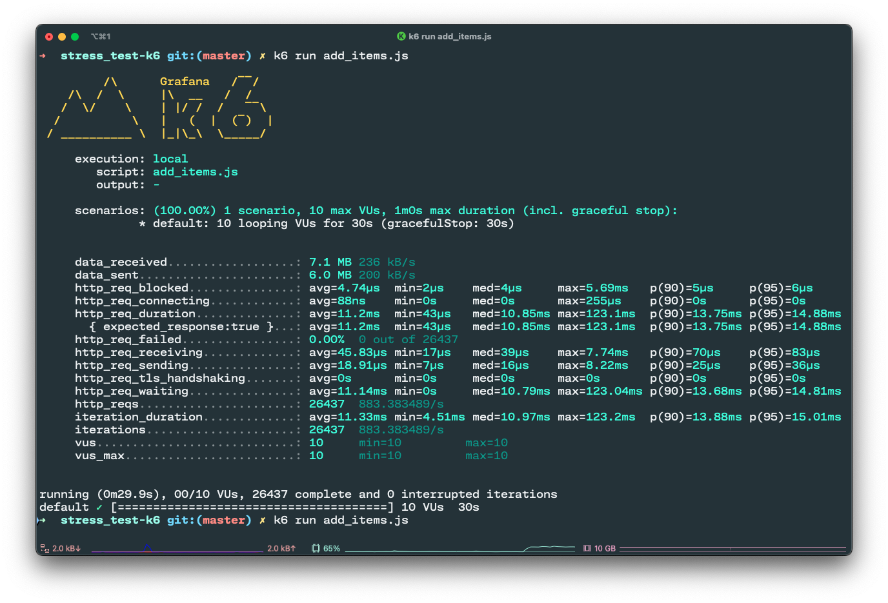

## Paidy: Simple Restaurant API
_https://github.com/paidy/interview/blob/master/SimpleRestaurantApi.md_

Project implements three Primary APIs + 1 health check API, which are:
- Add Item(s) to a table API
- Remove Item from a table API
- List Item(s) of a table API
- Health Check API

### Requirements Covered:
- ✅ The client (the restaurant staff “devices” making the requests) MUST be able to: add one or more items with a table number, remove an item for a table, and query the items still remaining for a table.
```bash
curl --location 'localhost:8080/table/add_items' \
--header 'Content-Type: application/json' \
--data '{
    "table_number": 1,
    "items_names": [
        "拉麺",
        "うどん",
        "そば",
        "そうめん",
        "中華そば",
        "とんかつ",
        "からあげ",
        "やきにく",
        "カレーライス",
        "オムライス"
    ]
}'
``` 
- ✅ The application MUST, upon creation request, store the item, the table number, and how long the item will take to cook.
- ✅ The application MUST, upon deletion request, remove a specified item for a specified table number.
```bash
curl --location --request DELETE 'localhost:8080/table/remove_item' \
--header 'Content-Type: application/json' \
--data '{
    "item_id": 7
}'
```
- ✅ The application MUST, upon query request, show all items for a specified table number.
```bash
curl --location --request GET 'localhost:8080/table/list_items' \
--header 'Content-Type: application/json' \
--data '{
    "table_number": 1
}'
```
- ✅ The application MUST, upon query request, show a specified item for a specified table number.
```bash
curl --location --request GET 'localhost:8080/table/list_items' \
--header 'Content-Type: application/json' \
--data '{
    "table_number": 1,
    "items_ids": [8, 9]
}'
```
or
```bash
curl --location --request GET 'localhost:8080/table/list_items' \
--header 'Content-Type: application/json' \
--data '{
    "table_number": 1,
    "items_names": ["うどん"]
}'
```
- ✅ The application MUST accept at least 10 simultaneous incoming add/remove/query requests.


- ✅ The client MAY limit the number of specific tables in its requests to a finite set (at least 100).
- ✅ The application MAY assign a length of time for the item to prepare as a random time between 5-15 minutes.
- ✅ The application MAY keep the length of time for the item to prepare static

---
#### How to run
- Inside the folder, `simple-restaurant-api`, execute: 
 ```bash
docker-compose up
```
Although, the application boots up in no time, this project gives keeps a small wait after mysql-database is initialized

---

#### How to Test APIs
- install hurl by running:
```bash
brew install hurl
```
- inside testing folder execute
```bash
hurl --test .
```
this will test all apis, and their cases, one by one

---

#### How to Stress Test APIs
- install k6 by running:
```bash
brew install k6
```
- Stress test by executing k6 command with appropriate parameters which are defined inside the .js file for stress test
```bash
k6 run add_items.js --console-output=console_out.txt
```
- k6's configurable parameters:
```bash
vus: number of concurrent requests
duration: amount of time to continue hammering the API endpoint
```
